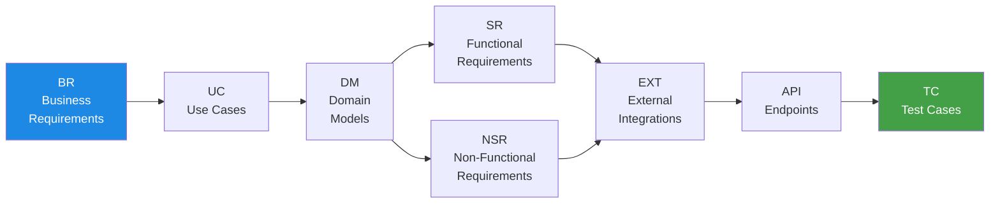
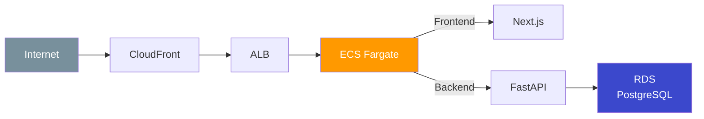

[](https://github.com/syotakokichi/docdd-starters/actions/workflows/docdd-starters-ci.yml)
[](LICENSE)
[](https://www.python.org/)
[](https://nodejs.org/)
[](https://fastapi.tiangolo.com/)
[](https://nextjs.org/)
[](https://www.terraform.io/)
[](https://www.docker.com/)
[](https://aws.amazon.com/)

> **Japanese version**: [README.md](README.md)

A starter template for Doc Driven Development (DocDD) with 7-axis Traceability, featuring a FastAPI backend and Next.js frontend in a modular monolith architecture.

## What is DocDD?

DocDD (Doc Driven Development) is a development methodology that maintains **end-to-end traceability across 7 axes** — from requirements to tests. Instead of treating documentation as a one-time artifact, it directly connects docs to code and tests, ensuring you can always trace back "why this implementation exists."



> Choose the axes that fit your project's scale and nature — the goal is to **keep changes traceable**.

## Features

- **7-axis Traceability** - Full traceability from requirements to test cases
- **FastAPI + Modular Monolith** - Async-first Python backend with auto-generated API docs and strong AI/data science library support
- **Next.js App Router** - Server Components / Server Actions with shadcn/ui and Biome ecosystem
- **Claude Code Integration** - Issue-driven development automated via slash commands (`/issue` → `/plan` → `/develop` → `/verify` → `/pr` → `/merge`)
- **Marp Slide Generation** - Turn development outcomes and designs into presentations with `/slide`
- **CI/CD** - GitHub Actions for testing, linting, and deployment
- **Terraform** - Infrastructure as Code for AWS ECS Fargate

## Who Is This For?

- Solo developers or small teams building web apps (SaaS, internal tools, etc.)
- Projects that start small and scale gradually with a modular monolith architecture
- Teams that want to trace back "why was this built this way?" at any point
- Developers leveraging Claude Code for AI-assisted development workflows

## Quick Start

### Prerequisites

| Tool | Version |
|------|---------|
| Python | 3.11+ |
| Node.js | 20+ |
| Docker & Docker Compose | Latest recommended |
| Git | 2.5+ (for Worktree support) |

### Setup

```bash
# 1. Clone the repository
git clone https://github.com/syotakokichi/docdd-starters.git
cd docdd-starters

# 2. Configure environment variables
cp .env.example .env

# 3. Install dependencies
npm --prefix apps/frontend install
pip install -r apps/backend/requirements-dev.txt
pip install -r scripts/test/requirements.txt

# 4. Start the backend
make up        # Stop with: make down
```

### Run Tests

```bash
make test              # All tests
make test-backend      # Backend only
make test-frontend     # Frontend only
make traceability      # Traceability map validation
```

## Directory Structure

```
apps/
  backend/              # FastAPI modular monolith
  frontend/             # Next.js App Router
docs/
  7-axis/               # DocDD 7-axis traceability documents
  testing/              # Test management & traceability maps
scripts/                # Test validation & deploy scripts
terraform/              # AWS ECS Fargate infrastructure
tests/                  # Backend & frontend tests
.claude/                # Claude Code commands, skills & rules
.github/workflows/      # CI/CD workflows
```

## Documentation

| Category | Link |
|----------|------|
| 7-axis Templates | [docs/7-axis](docs/7-axis) |
| Backend Guide | [docs/backend/README.md](docs/backend/README.md) |
| Frontend Guide | [docs/frontend/README.md](docs/frontend/README.md) |
| Testing Guide | [docs/testing/README.md](docs/testing/README.md) |
| Terraform Guide | [terraform/README.md](terraform/README.md) |
| CI Workflow | [docs/ci.md](docs/ci.md) |
| Claude Code Guide | [.claude/CLAUDE.md](.claude/CLAUDE.md) |

## Claude Code Development Flow

Automate the full cycle from issue creation to PR merge with slash commands (`/issue` → `/plan` → `/develop` → `/verify` → `/pr` → `/merge`). Parallel development across multiple issues is supported via `/worktree` (see [docs/guides/migration-from-legacy-commands.md](docs/guides/migration-from-legacy-commands.md) for migration from removed legacy commands).

Use `/slide` to generate Marp-based presentations — ideal for sharing development outcomes, architectural decisions, and technical proposals.

See [.claude/commands/README.md](.claude/commands/README.md) for details.

## Infrastructure



Managed via Terraform with per-environment configs (staging / production) and deploy scripts included. See [terraform/README.md](terraform/README.md) for details.

## Contributing

Issues and Pull Requests are welcome. See [.claude/commands/README.md](.claude/commands/README.md) for the development workflow.

## License

MIT License - See [LICENSE](LICENSE) for details.
