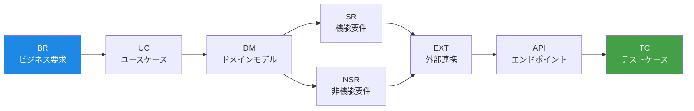
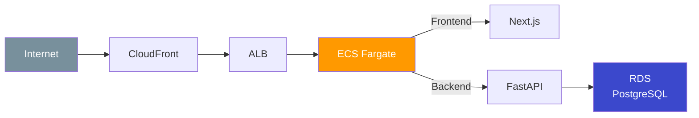

[](https://github.com/syotakokichi/docdd-starters/actions/workflows/docdd-starters-ci.yml)
[](LICENSE)
[](https://www.python.org/)
[](https://nodejs.org/)
[](https://fastapi.tiangolo.com/)
[](https://nextjs.org/)
[](https://www.terraform.io/)
[](https://www.docker.com/)
[](https://aws.amazon.com/)

> **English version**: [README.en.md](README.en.md)

Doc Driven Development (DocDD) と 7-axis Traceability を軸に、バックエンド (FastAPI) とフロントエンド (Next.js) のモジュラーモノリス構成を素早く立ち上げるためのテンプレートです。

## DocDD とは

DocDD（Doc Driven Development）は、要件定義からテストまでを **7 つの軸** で一貫して追跡可能にする開発手法です。ドキュメントを「書いて終わり」にせず、コードとテストに直結させることで、「なぜこの実装があるのか」を常に辿れる状態を維持します。



> プロジェクトの規模や性質に応じて必要な軸を選択し、**変更の影響を辿れる状態を保つ**ことが目的です。

## 特徴

- **7-axis Traceability** - 要件からテストまで全工程を追跡可能
- **FastAPI + モジュラーモノリス** - 非同期処理・APIドキュメント自動生成・AI/データ分析ライブラリとの高い親和性
- **Next.js App Router** - Server Components / Server Actions 対応。shadcn/ui・Biome 等のエコシステム活用
- **Claude Code 統合** - Issue 駆動開発をスラッシュコマンド（`/1`〜`/7`）で自動化
- **Marp スライド生成** - 開発成果や設計を `/slide` コマンドで即プレゼン資料化
- **CI/CD** - GitHub Actions によるテスト・リント・デプロイ自動化
- **Terraform** - AWS ECS Fargate によるインフラ構成管理

## こんなプロジェクトに向いています

- 個人や少人数チームで Web アプリ（SaaS・社内ツール等）を立ち上げたい
- 小さく始めて、モジュラーモノリスの構造で中規模まで段階的にスケールしたい
- 「なぜその実装にしたか」を後から辿れるようにしておきたい
- Claude Code を活用した AI アシスト開発で効率化したい

## Quick Start

### 前提条件

| ツール | バージョン |
|--------|-----------|
| Python | 3.11+ |
| Node.js | 20+ |
| Docker & Docker Compose | 最新版推奨 |
| Git | 2.5+（Worktree 利用時） |

### セットアップ

```bash
# 1. リポジトリをクローン
git clone https://github.com/syotakokichi/docdd-starters.git
cd docdd-starters

# 2. 環境変数を設定
cp .env.example .env

# 3. 依存関係をインストール
npm --prefix apps/frontend install
pip install -r apps/backend/requirements-dev.txt
pip install -r scripts/test/requirements.txt

# 4. バックエンドを起動
make up        # 停止は make down
```

### テスト実行

```bash
make test              # 全テスト
make test-backend      # バックエンドのみ
make test-frontend     # フロントエンドのみ
make traceability      # トレーサビリティマップ検証
```

## ディレクトリ構成

```
apps/
  backend/              # FastAPI モジュラーモノリス
  frontend/             # Next.js App Router
docs/
  7-axis/               # DocDD 7軸トレーサビリティドキュメント
  testing/              # テスト管理・トレーサビリティmap
scripts/                # テスト検証・デプロイスクリプト
terraform/              # AWS ECS Fargate インフラ構成
tests/                  # バックエンド・フロントエンドテスト
.claude/                # Claude Code コマンド・スキル・ルール
.github/workflows/      # CI/CD ワークフロー
```

## ドキュメント

| カテゴリ | リンク |
|---------|--------|
| 7-axis テンプレート | [docs/7-axis](docs/7-axis) |
| バックエンドガイド | [docs/backend/README.md](docs/backend/README.md) |
| フロントエンドガイド | [docs/frontend/README.md](docs/frontend/README.md) |
| テストガイド | [docs/testing/README.md](docs/testing/README.md) |
| Terraform ガイド | [terraform/README.md](terraform/README.md) |
| CI ワークフロー | [docs/ci.md](docs/ci.md) |
| Claude Code ガイド | [.claude/CLAUDE.md](.claude/CLAUDE.md) |

## Claude Code 開発フロー

Issue 作成から PR マージまでを `/1`〜`/7` のスラッシュコマンドで一気通貫。Worktree（`/a`〜`/c`）による複数 Issue の並列開発にも対応しています。

`/slide` コマンドで Marp 形式のプレゼン資料を生成でき、開発成果や技術選定の共有にそのまま活用できます。

詳細は [.claude/commands/README.md](.claude/commands/README.md) を参照。

## インフラ



Terraform による IaC 管理。環境別設定（stg / prod）とデプロイスクリプトを同梱しています。詳細は [terraform/README.md](terraform/README.md) を参照。

## Contributing

Issue や Pull Request を歓迎します。開発フローについては [.claude/commands/README.md](.claude/commands/README.md) を参照してください。

## License

MIT License - 詳細は [LICENSE](LICENSE) を参照。
